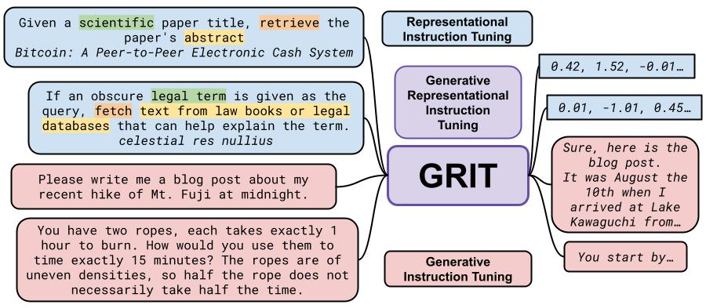

## Generative Representational Instruction Tuning



This repository provides all materials for the paper [Generative Representational Instruction Tuning](https://arxiv.org/abs/2402.09906). We continue developing the repository and welcome any contributions. If you want to use the code in the exact same way as in the paper, please use the 1.0.0 release (commit hash = `3ac39052ef878371a658a060e69f9c0124bfd59b`).

- [Inference](#inference)
    - [Basic](#basic)
    - [Caching](#caching)
    - [Models](#models)
- [Training](#training)
    - [Data](#data)
    - [Run](#run)
    - [Alignment](#alignment)
- [Evaluation](#evaluation)
    - [Embedding](#embedding)
    - [Generative](#generative)
- [Known issues](#known-issues)
- [Visuals](#visuals)
- [Acknowledgements](#acknowledgements)
- [Citation](#citation)

### Inference

#### Basic

`pip install gritlm`

```python
from gritlm import GritLM

# Loads the model for both capabilities; If you only need embedding pass `mode="embedding"` to save memory (no lm head)
model = GritLM("GritLM/GritLM-7B", torch_dtype="auto")
# To load the 8x7B you will likely need multiple GPUs.
# All the kwargs are passed to HF from_pretrained so you can just do the below to load on multiple GPUs:
# model = GritLM("GritLM/GritLM-8x7B", torch_dtype="auto", device_map="auto")
# You can also load other models e.g.
# model = GritLM("Muennighoff/SGPT-125M-weightedmean-nli-bitfit", pooling_method="weighted_mean", attn=None)
# model = GritLM("hkunlp/instructor-base", pooling_method="mean", attn=None)

### Embedding/Representation ###
instruction = "Given a scientific paper title, retrieve the paper's abstract"
queries = ['Bitcoin: A Peer-to-Peer Electronic Cash System', 'Generative Representational Instruction Tuning']
documents = [
    "A purely peer-to-peer version of electronic cash would allow online payments to be sent directly from one party to another without going through a financial institution. Digital signatures provide part of the solution, but the main benefits are lost if a trusted third party is still required to prevent double-spending. We propose a solution to the double-spending problem using a peer-to-peer network. The network timestamps transactions by hashing them into an ongoing chain of hash-based proof-of-work, forming a record that cannot be changed without redoing the proof-of-work. The longest chain not only serves as proof of the sequence of events witnessed, but proof that it came from the largest pool of CPU power. As long as a majority of CPU power is controlled by nodes that are not cooperating to attack the network, they'll generate the longest chain and outpace attackers. The network itself requires minimal structure. Messages are broadcast on a best effort basis, and nodes can leave and rejoin the network at will, accepting the longest proof-of-work chain as proof of what happened while they were gone.",
    "All text-based language problems can be reduced to either generation or embedding. Current models only perform well at one or the other. We introduce generative representational instruction tuning (GRIT) whereby a large language model is trained to handle both generative and embedding tasks by distinguishing between them through instructions. Compared to other open models, our resulting GritLM 7B sets a new state of the art on the Massive Text Embedding Benchmark (MTEB) and outperforms all models up to its size on a range of generative tasks. By scaling up further, GritLM 8X7B outperforms all open generative language models that we tried while still being among the best embedding models. Notably, we find that GRIT matches training on only generative or embedding data, thus we can unify both at no performance loss. Among other benefits, the unification via GRIT speeds up Retrieval-Augmented Generation (RAG) by > 60% for long documents, by no longer requiring separate retrieval and generation models. Models, code, etc. are freely available at https://github.com/ContextualAI/gritlm."
]

def gritlm_instruction(instruction):
    return "<|user|>\n" + instruction + "\n<|embed|>\n" if instruction else "<|embed|>\n"

# No need to add instruction for retrieval documents
d_rep = model.encode(documents, instruction=gritlm_instruction(""))
q_rep = model.encode(queries, instruction=gritlm_instruction(instruction))

from scipy.spatial.distance import cosine
cosine_sim_q0_d0 = 1 - cosine(q_rep[0], d_rep[0])
cosine_sim_q0_d1 = 1 - cosine(q_rep[0], d_rep[1])
cosine_sim_q1_d0 = 1 - cosine(q_rep[1], d_rep[0])
cosine_sim_q1_d1 = 1 - cosine(q_rep[1], d_rep[1])

print("Cosine similarity between \"%s\" and \"%s\" is: %.3f" % (queries[0][:15], documents[0][:15], cosine_sim_q0_d0))
# Cosine similarity between "Bitcoin: A Peer" and "A purely peer-t" is: 0.608
print("Cosine similarity between \"%s\" and \"%s\" is: %.3f" % (queries[0][:15], documents[1][:15], cosine_sim_q0_d1))
# Cosine similarity between "Bitcoin: A Peer" and "All text-based " is: 0.101
print("Cosine similarity between \"%s\" and \"%s\" is: %.3f" % (queries[1][:15], documents[0][:15], cosine_sim_q1_d0))
# Cosine similarity between "Generative Repr" and "A purely peer-t" is: 0.120
print("Cosine similarity between \"%s\" and \"%s\" is: %.3f" % (queries[1][:15], documents[1][:15], cosine_sim_q1_d1))
# Cosine similarity between "Generative Repr" and "All text-based " is: 0.533

### Generation ###
# We did not finetune GritLM models with system prompts, as you can just include system-like instructions together with your user instruction
messages = [
    {"role": "user", "content": "Please write me a poem about my recent hike of Mt. Fuji at midnight in the style of Shakespeare."},
]
encoded = model.tokenizer.apply_chat_template(messages, add_generation_prompt=True, return_tensors="pt")
encoded = encoded.to(model.device)
gen = model.generate(encoded, max_new_tokens=256, do_sample=False)
decoded = model.tokenizer.batch_decode(gen)
print(decoded[0])
"""
<s> <|user|>
Please write me a poem about my recent hike of Mt. Fuji at midnight in the style of Shakespeare.
<|assistant|>
Oh, Mt. Fuji, mountain grand,
A sight to see, a climb to command,
At midnight, in the dark of night,
I climbed your slopes, with all my might.

The stars above, they shone so bright,
A beacon in the darkness, guiding light,
The wind did blow, with a gentle sigh,
As I climbed higher, with a steady eye.

The path was steep, the climb was tough,
But I pressed on, with a steadfast rough,
For the summit, I longed to see,
The view from the top, a sight to be.

At last, I reached the peak, and stood,
With awe and wonder, I gazed aloud,
The world below, a sight to see,
A view that's worth the climb, you'll agree.

Mt. Fuji, mountain grand,
A sight to see, a climb to command,
At midnight, in the dark of night,
I climbed your slopes, with all my might.</s>
"""
```

#### Caching

`pip install gritlm`

```python
import numpy as np
import torch
from gritlm import GritLM

# Loads the model for both capabilities; If you only need embedding pass `mode="embedding"` to save memory (no lm head)
model = GritLM("GritLM/GritLM-7B", torch_dtype="auto")
# To load the 8x7B you will likely need multiple GPUs.
# All the kwargs are passed to HF from_pretrained so you can just do the below to load on multiple GPUs:
# model = GritLM("GritLM/GritLM-8x7B", torch_dtype="auto", device_map="auto")
# You can also load other models e.g.
# model = GritLM("Muennighoff/SGPT-125M-weightedmean-nli-bitfit", pooling_method="weighted_mean", attn=None)
# model = GritLM("hkunlp/instructor-base", pooling_method="mean", attn=None)

queries = ['Please explain to me how Bitcoin works.', 'What is "Generative Representational Instruction Tuning"?']
documents = [
    "A purely peer-to-peer version of electronic cash would allow online payments to be sent directly from one party to another without going through a financial institution. Digital signatures provide part of the solution, but the main benefits are lost if a trusted third party is still required to prevent double-spending. We propose a solution to the double-spending problem using a peer-to-peer network. The network timestamps transactions by hashing them into an ongoing chain of hash-based proof-of-work, forming a record that cannot be changed without redoing the proof-of-work. The longest chain not only serves as proof of the sequence of events witnessed, but proof that it came from the largest pool of CPU power. As long as a majority of CPU power is controlled by nodes that are not cooperating to attack the network, they'll generate the longest chain and outpace attackers. The network itself requires minimal structure. Messages are broadcast on a best effort basis, and nodes can leave and rejoin the network at will, accepting the longest proof-of-work chain as proof of what happened while they were gone.",
    "All text-based language problems can be reduced to either generation or embedding. Current models only perform well at one or the other. We introduce generative representational instruction tuning (GRIT) whereby a large language model is trained to handle both generative and embedding tasks by distinguishing between them through instructions. Compared to other open models, our resulting GritLM 7B sets a new state of the art on the Massive Text Embedding Benchmark (MTEB) and outperforms all models up to its size on a range of generative tasks. By scaling up further, GritLM 8X7B outperforms all open generative language models that we tried while still being among the best embedding models. Notably, we find that GRIT matches training on only generative or embedding data, thus we can unify both at no performance loss. Among other benefits, the unification via GRIT speeds up Retrieval-Augmented Generation (RAG) by > 60% for long documents, by no longer requiring separate retrieval and generation models. Models, code, etc. are freely available at https://github.com/ContextualAI/gritlm."
]

CACHE_FORMAT_DOC = "\n<|user|>\n{query}\n\nAnswer the prior query while optionally using the context prior to it\n<|assistant|>\n"
CACHE_FORMAT_QUERY = "\n<|user|>\n{doc}\n\nOptionally using the prior context answer the query prior to it\n<|assistant|>\n"
CACHE_FORMAT_QUERY_DOC = "\n<|user|>\nOptionally using the prior context answer the query prior to it\n<|assistant|>\n"
CACHE_FORMAT_DOC_QUERY = "\n<|user|>\nAnswer the prior query while optionally using the context prior to it\n<|assistant|>\n"

def gritlm_instruction(instruction):
    return "<|user|>\n" + instruction + "\n<|embed|>\n" if instruction else "<|embed|>\n"

### GRIT DOC CACHING ###
# cache: Tuple of `tuple(torch.FloatTensor)` of length `config.n_layers`, with each tuple having 2 tensors of shape `(batch_size, num_heads, sequence_length, embed_size_per_head)`
d_rep, d_cache = model.encode(documents, instruction=gritlm_instruction(""), get_cache=True)
q_rep = model.encode(queries, instruction=gritlm_instruction(""))

from scipy.spatial.distance import cosine
sims = {q: [1 - cosine(q_rep[i], d_rep[j]) for j in range(len(d_rep))] for i, q in enumerate(queries)}

for q, q_sims in sims.items():
    sim_idx = np.argmax(q_sims)
    cache = tuple([
        (d_cache[i][0][sim_idx:sim_idx+1], d_cache[i][1][sim_idx:sim_idx+1]) for i, c in enumerate(d_cache)
    ])
    # BOS is already in the cache
    inputs = model.tokenizer(CACHE_FORMAT_DOC.format(query=q), return_tensors="pt", add_special_tokens=False).to(model.device)
    inputs["use_cache"] = True
    # Attend to the cache too
    inputs["attention_mask"] = torch.cat((
        torch.ones((cache[0][0].shape[0], cache[0][0].shape[2]), dtype=torch.long, device=inputs["attention_mask"].device),
        inputs["attention_mask"],
    ), dim=1)
    generation = model.generate(**inputs, max_new_tokens=256, past_key_values=cache, do_sample=False)
    decoded = model.tokenizer.batch_decode(generation)
    print(decoded[0])

"""
<|user|>
What is "Generative Representational Instruction Tuning"?

Answer the prior query while optionally using the context prior to it
<|assistant|>
Generative Representational Instruction Tuning (GRIT) is a method for training language models that can perform both generative and embedding tasks. It involves training a large language model to handle both types of tasks by distinguishing between them through instructions. GRIT is designed to improve the performance of language models on both generative and embedding tasks, and it can be used to unify both types of tasks at no performance loss.</s>
"""


### GRIT QUERY CACHING ###
# cache: Tuple of `tuple(torch.FloatTensor)` of length `config.n_layers`, with each tuple having 2 tensors of shape `(batch_size, num_heads, sequence_length, embed_size_per_head)`
d_rep = model.encode(documents, instruction=gritlm_instruction(""))
q_rep, q_cache = model.encode(queries, instruction=gritlm_instruction(""), get_cache=True)

from scipy.spatial.distance import cosine
sims = {d: [1 - cosine(q_rep[i], d_rep[j]) for j in range(len(d_rep))] for i, d in enumerate(documents)}

for d, d_sims in sims.items():
    sim_idx = np.argmax(d_sims)
    cache = tuple([
        (q_cache[i][0][sim_idx:sim_idx+1], q_cache[i][1][sim_idx:sim_idx+1]) for i, c in enumerate(q_cache)
    ])
    # BOS is already in the cache
    inputs = model.tokenizer(CACHE_FORMAT_QUERY.format(doc=d), return_tensors="pt", add_special_tokens=False).to(model.device)
    inputs["use_cache"] = True
    # Attend to the cache too
    inputs["attention_mask"] = torch.cat((
        torch.ones((cache[0][0].shape[0], cache[0][0].shape[2]), dtype=torch.long, device=inputs["attention_mask"].device),
        inputs["attention_mask"],
    ), dim=1)
    generation = model.generate(**inputs, max_new_tokens=256, past_key_values=cache, do_sample=False)
    decoded = model.tokenizer.batch_decode(generation)
    print(decoded[0])

"""
<|user|>
All text-based language problems can be reduced to either generation or embedding. Current models only perform well at one or the other. We introduce generative representational instruction tuning (GRIT) whereby a large language model is trained to handle both generative and embedding tasks by distinguishing between them through instructions. Compared to other open models, our resulting GritLM 7B sets a new state of the art on the Massive Text Embedding Benchmark (MTEB) and outperforms all models up to its size on a range of generative tasks. By scaling up further, GritLM 8X7B outperforms all open generative language models that we tried while still being among the best embedding models. Notably, we find that GRIT matches training on only generative or embedding data, thus we can unify both at no performance loss. Among other benefits, the unification via GRIT speeds up Retrieval-Augmented Generation (RAG) by > 60% for long documents, by no longer requiring separate retrieval and generation models. Models, code, etc. are freely available at https://github.com/ContextualAI/gritlm.

Optionally using the prior context answer the query prior to it
<|assistant|>
GRIT stands for generative representational instruction tuning. It is a method for training large language models to handle both generative and embedding tasks by distinguishing between them through instructions. GritLM is a large language model trained using GRIT that sets a new state of the art on the Massive Text Embedding Benchmark (MTEB) and outperforms all models up to its size on a range of generative tasks. GritLM 8X7B is a larger version of GritLM that outperforms all open generative language models that were tried while still being among the best embedding models. GRIT matches training on only generative or embedding data, thus unifying both at no performance loss. This unification via GRIT speeds up Retrieval-Augmented Generation (RAG) by > 60% for long documents, by no longer requiring separate retrieval and generation models. Models, code, etc. are freely available at <https://github.com/ContextualAI/gritlm>.</s>
"""


### GRIT QUERY-DOC CACHING ###
# cache: Tuple of `tuple(torch.FloatTensor)` of length `config.n_layers`, with each tuple having 2 tensors of shape `(batch_size, num_heads, sequence_length, embed_size_per_head)`
d_rep, d_cache = model.encode(documents, instruction=gritlm_instruction(""), get_cache=True, add_special_tokens=False)
q_rep, q_cache = model.encode(queries, instruction=gritlm_instruction(""), get_cache=True)

from scipy.spatial.distance import cosine
sims = {q: [1 - cosine(q_rep[i], d_rep[j]) for j in range(len(d_rep))] for i, q in enumerate(queries)}

for i, (q, q_sims) in enumerate(sims.items()):
    sim_idx = np.argmax(q_sims)
    cache_query = tuple([
        (q_cache[j][0][i:i+1], q_cache[j][1][i:i+1]) for j, c in enumerate(q_cache)
    ])
    cache_doc = tuple([
        (d_cache[j][0][sim_idx:sim_idx+1], d_cache[j][1][sim_idx:sim_idx+1]) for j, c in enumerate(d_cache)
    ])
    # For DOC-QUERY simply swap the order of the cache, change the format to CACHE_FORMAT_DOC_QUERY & set add_special_tokens=True in the `model.encode(..` above
    cache = [(
        torch.cat((layer[0], cache_doc[i][0]), dim=2),
        torch.cat((layer[1], cache_doc[i][1]), dim=2),
    ) for i, layer in enumerate(cache_query)]
    # BOS is already in the cache
    inputs = model.tokenizer(CACHE_FORMAT_QUERY_DOC, return_tensors="pt", add_special_tokens=False).to(model.device)
    inputs["use_cache"] = True
    # Attend to the cache too
    inputs["attention_mask"] = torch.cat((
        torch.ones((cache[0][0].shape[0], cache[0][0].shape[2]), dtype=torch.long, device=inputs["attention_mask"].device),
        inputs["attention_mask"],
    ), dim=1)
    generation = model.generate(**inputs, max_new_tokens=256, past_key_values=cache, do_sample=False)
    decoded = model.tokenizer.batch_decode(generation)
    print(decoded[0])

"""
<|user|>
Optionally using the prior context answer the query prior to it
<|assistant|>
Sure, here's an example of how the prior context could be used to answer a query:

Query: "What is GRIT?"

Prior context: "We introduce generative representation instruction tuning (GRIT) whereby a large language model is trained to handle both generative and embedding tasks by distinguishing between them through instructions."

Answer: GRIT is a method for training language models to handle both generative and embedding tasks by distinguishing between them through instructions.</s>
"""
```

#### Models

The weights and logs of all models from the paper are freely available:
- Weights: https://huggingface.co/GritLM
- Logs: https://wandb.ai/muennighoff/gritlm/overview?workspace=user-muennighoff

The names will not always match across HF & WandB, but you can usually figure out which belongs to which via the `--output_dir` in the command. Note that we renamed all models from `sgpt2` to `gritlm` at some point, so some names/logs/commands contain the old name.

Shortcuts:
- sq = sequence length; sq2048 is 2048 tokens
- ep = epochs; ep1 is 1 epoch
- st = steps; st100 is 100 steps
- m7/m8x7/l7/g6 = base model is Mistral 7B/Mistral 8x7B/Llama 2 7B/GPT-J 6B
- emb/gen/gritlm = embedding, generative, unified
- bf16c = embeddings are cast back to bf16 after pooling and similarity computation is also done in bf16 (simulating how cached embeddings would operate)
- bb/cc/bbcc... = order of bidirectional vs causal attention
- gendups = not using `--use_unique_indices` during training. If not used and training is unified, then data is duplicated worsening performance

The most important ones are:

| Model |                                                                 Description                                                                 | Emb performance (MTEB) | Gen performance |
|:------|:-------------------------------------------------------------------------------------------------------------------------------------------:|:----------------------:| :--------------:|
| [GritLM-7B](https://huggingface.co/GritLM/gritlm-7b) |   7B parameter model that uses bidirectional attention for embedding and causal attention for generation. It is finetuned from Mistral-7B   | 66.8 | 55.5 |
| [GritLM-8x7B](https://huggingface.co/GritLM/gritlm-8x7b) | 8x7B parameter model that uses bidirectional attention for embedding and causal attention for generation. It is finetuned from Mistral-8x7B | 65.7 | 65.7 |
| [Generative-only variant](https://hf.co/GritLM/gen_m7_sq2048_tulu2_ep1) |                                         7B parameter model generative-only equivalent of GritLM-7B.                                         | 41.2 | 55.2 |
| [Embedding-only variant](https://hf.co/GritLM/emb_m7_nodes16_fast) |                                         7B parameter model embedding-only equivalent of GritLM-7B.                                          | 66.8 | 7.6 |

For `GritLM-7B` and `GritLM-8x7B`, the folder contains a custom modeling file (`modeling_gritlm*.py`) which adds bidirectional attention via the keyword argument `is_causal`, such that if you load them with `from_pretrained` in transformers, it is automatically available. We did not add this for any other models uploaded to the organization, thus for those, you need to either add it yourself or simply replace the `modeling_mistral.py` & `modeling_mixtral.py` files in your transformers installation with `scripts/modeling_mistral_gritlm.py` & `scripts/modeling_mixtral_gritlm.py`. Note that for models that do not use bidirectional attention or when you do not intend to use the bidirectional attention (e.g. for generation), you don't need to do anything.


### Training

#### Data

The repo uses the below format. See `training/toy_data.jsonl` for an example.

Format:
- Embedding data: `{"query": str, "pos": List[str], "neg": List[str]}`
- Embedding data with instructions that are excluded from the embedding & loss: `{"query": List[str, str], "pos": List[List[str, str]], "neg": List[List[str, str]]}`
    - The 1st element in the inner list is the instruction and the 2nd is the text to embed.
- Generative data: `{"text": str}`
- Generative data with instructions that are excluded from the loss: `{"text": List[str]}`
    - The 1st/3rd/5th.. element is the instruction and the 2nd/4th/6th.. is the response. If you only want single-turn chat then just put two elements, for multi-turn put more.


We release the below datasets:
- Embedding:
  - MEDI (https://hf.co/datasets/GritLM/MEDI)
  - MEDI2 (https://hf.co/datasets/GritLM/MEDI2)
  - MEDI2BGE (https://hf.co/datasets/GritLM/MEDI2BGE)
- Generative:
  - https://hf.co/datasets/GritLM/tulu2

They are explained in more detail in the paper and its appendix. So to e.g. train a GRIT model on MEDI2 & Tulu2, simply download both via `git clone https...` and then place them in the same directory and follow the instructions below to run. Unfortunately, we cannot release the E5S data used for our final models.

#### Run

Setup:
```bash
# First install PyTorch (https://pytorch.org/get-started/locally/; we used torch==2.2.0 with NVIDIA-SMI 535.104.05, Driver Version: 535.104.05, CUDA Version: 12.2), then do the below
git clone https://github.com/ContextualAI/gritlm
cd gritlm
pip install -e .
# If you want to use GradCache, you need to use the one in this repository
cd gritlm/training/GradCache
pip install -e .
cd ../..
```

Below are easy examples for getting started:

**Embedding model**

```bash
torchrun --nproc_per_node 1 \
-m training.run \
--output_dir test_path \
--model_name_or_path openaccess-ai-collective/tiny-mistral \
--train_data training/toy_data/toy_data_embedding.jsonl \
--learning_rate 1e-5 \
--num_train_epochs 5 \
--per_device_train_batch_size 2 \
--dataloader_drop_last True \
--normalized True \
--temperature 0.02 \
--query_max_len 32 \
--passage_max_len 128 \
--train_group_size 2 \
--mode embedding \
--attn cccc
```

**Generative model**

```bash
torchrun --nproc_per_node 1 \
-m training.run \
--output_dir test_path \
--model_name_or_path openaccess-ai-collective/tiny-mistral \
--train_data training/toy_data/toy_data_generative.jsonl \
--learning_rate 1e-5 \
--num_train_epochs 5 \
--per_device_train_batch_size 2 \
--dataloader_drop_last True \
--passage_max_len 128 \
--mode generative \
--attn cccc
```

**Unified model (GRIT)**

```bash
torchrun --nproc_per_node 1 \
-m training.run \
--output_dir test_path \
--model_name_or_path openaccess-ai-collective/tiny-mistral \
--train_data training/toy_data \
--learning_rate 1e-5 \
--num_train_epochs 5 \
--per_device_train_batch_size 2 \
--dataloader_drop_last True \
--normalized True \
--temperature 0.02 \
--query_max_len 32 \
--passage_max_len 128 \
--train_group_size 2 \
--mode unified \
--attn cccc
```

All arguments are explained in `training/arguments.py` or the [HF TrainingArguments documentation](https://hf.co/docs/transformers/main/en/main_classes/trainer#transformers.TrainingArguments) except for `nproc_per_node` which is the number of GPUs per node. For our actual training runs, we use accelerate to easily use multiple nodes and GPUs as well as slightly different settings (e.g. `--attn bbcc`). The scripts are all in `scripts/training`, for example `scripts/training/train_gritlm_8x7b.sh` was used for GritLM-8x7B. For models from the ablations, you can check their folder on the huggingface hub which contains a `training_args.bin` file with the arguments. You can also check all their arguments on the WandB: https://wandb.ai/muennighoff/gritlm. After training, you may first have to run `python scripts/reformat_statedict.py path_to_statedict` to remove the `model.` prefix from the checkpoint, and then you can shard the checkpoint via `python scripts/shard.py path_to_model_folder` for easier usage.

#### Alignment

For the experiments on aligning GritLM with KTO we use https://github.com/huggingface/trl with the scripts in https://github.com/Muennighoff/kto.

### Evaluation

#### Embedding

```bash
cd gritlm
python evaluation/eval_mteb.py \
--model_name_or_path GritLM/GritLM-7B \
--task_types Classification,Clustering,PairClassification,Reranking,Retrieval,STS,Summarization \
--batch_size 32
```

For a faster way, check `scripts/eval_mteb.sh` which submits jobs across multiple GPUs for each dataset.

#### Generative

```bash
## Setup
# Setup eval for MMLU/GSM8K/BBH/TyDi QA/Alpaca
git clone https://github.com/Muennighoff/open-instruct.git
cd open-instruct
pip install -r requirements.txt
bash ./scripts/prepare_eval_data.sh
cd ..
# Setup eval for HumanEvalPack
git clone https://github.com/bigcode-project/bigcode-evaluation-harness
cd bigcode-evaluation-harness
pip install -e .
cd ..
MODEL_PATH=GritLM/gritlm-7b
# Run all evals except for Alpaca; You may have to change some paths etc.
bash scripts/generative_eval.sh {path to model}
# Run Alpaca 1.0
export OPENAI_API_KEY=YOUR_API_KEY
python -m eval.alpaca_farm.run_eval \
--use_vllm \
--model_name_or_path $MODEL_PATH \
--tokenizer_name_or_path $MODEL_PATH \
--save_dir ./ \
--use_chat_format \
--chat_formatting_function eval.templates.create_prompt_with_gritlm_chat_format
# Alpaca 2.0 (not used in the paper)
python -m eval.alpaca_farm.run_eval \
--use_vllm \
--model_name_or_path $MODEL_PATH \
--tokenizer_name_or_path $MODEL_PATH \
--save_dir $MODEL_PATH \
--use_chat_format \
--chat_formatting_function eval.templates.create_prompt_with_gritlm_chat_format \
--alpaca2
```

### Known issues

- If you train on many nodes + a large model + fsdp, you may encounter timeouts upon checkpoint saving with `FULL_STATE_DICT`. For example, training Mixtral on 32 nodes with 8 GPUs each, fails with the below. Usually the main node will finish the saving unless they are all in the same job manager who kills it. Unfortunately increasing the timeout limit seems not possibe? (https://discuss.pytorch.org/t/how-to-set-nccl-timeout-to-infinity/146006 ; https://github.com/huggingface/accelerate/issues/2236#issuecomment-1864809701) So the current solution is just to use less nodes or ensure the saving process does not get killed. Please let us know if you have a better solution.
```bash
[dojo-a3-ghpc-9:1]:  what():  [Rank 1] NCCL watchdog thread terminated with exception: [Rank 1] Watchdog caught collective operation timeout: WorkNCCL(SeqNum=683, OpType=_ALLGATHER_BASE, NumelIn=32768512, NumelOut=262148096, Timeout(ms)=600000) ran for 600032 milliseconds before timing out.
```
- Add Packing at least for gen, maybe also possible for emb; Need to be careful with the NextTokenLoss
- QLoRa / LoRa integration is not well-tested
```bash
RuntimeError: one of the variables needed for gradient computation has been modified by an inplace operation: [torch.cuda.LongTensor [20, 2048]] is at version 21; expected version 0 instead. Hint: enable anomaly detection to find the operation that failed to compute its gradient, with torch.autograd.set_detect_anomaly(True).
```
- If you run into the below error when doing multi-node training, try this https://github.com/huggingface/transformers/issues/26971#issuecomment-1868137087
```bash
load_state_dict_into_meta_model
    set_module_tensor_to_device(model, param_name, param_device, **set_module_kwargs)
  File "/env/lib/conda/gritlm/lib/python3.9/site-packages/accelerate/utils/modeling.py", line 317, in set_module_tensor_to_device
    new_value = value.to(device)
NotImplementedError: Cannot copy out of meta tensor; no data!
```
- DeepSpeed does not work with `--mode unified` and `--gradient_accumulation_steps` bigger than 1 (i.e. GradCache) (FSDP is ~equivalent so this is not high prio)
- `fsdp_use_orig_params: true` in the accelerate config is critical for performance, else it may not converge at all (see comparisons in the wandb runs)
- If you get the below error where training fails on saving, then upgrade accelerate & transformers
```bash
508 01/06/2024 08:28:40 - INFO - accelerate.utils.fsdp_utils -   Model saved to /data/niklas/gritlm/gritlm_mist_sq2048_medibgetuluv2_tuluformat_8nodes_oldtracc/tmp-checkpoint-500/pytorch_model.bin
509 01/06/2024 08:30:24 - INFO - accelerate.utils.fsdp_utils -   Saving Optimizer state to /data/niklas/gritlm/gritlm_mist_sq2048_medibgetuluv2_tuluformat_8nodes_oldtracc/tmp-checkpoint-500/optimizer.bin
510 Traceback (most recent call last):
511   File "/env/lib/conda/gritlmold/lib/python3.9/runpy.py", line 197, in _run_module_as_main
512     return _run_code(code, main_globals, None,
513   File "/env/lib/conda/gritlmold/lib/python3.9/runpy.py", line 87, in _run_code
514     exec(code, run_globals)
515   File "/home/niklas/gritlm/training/run.py", line 421, in <module>
516     main()
517   File "/home/niklas/gritlm/training/run.py", line 411, in main
518     trainer.train()
519   File "/env/lib/conda/gritlmold/lib/python3.9/site-packages/transformers/trainer.py", line 1537, in train
520     return inner_training_loop(
521   File "/home/niklas/gritlm/training/gradcache_trainer.py", line 962, in _inner_training_loop
522     self._maybe_log_save_evaluate(tr_loss, model, trial, epoch, ignore_keys_for_eval)
523   File "/env/lib/conda/gritlmold/lib/python3.9/site-packages/transformers/trainer.py", line 2274, in _maybe_log_save_evaluate
524     self._save_checkpoint(model, trial, metrics=metrics)
525   File "/env/lib/conda/gritlmold/lib/python3.9/site-packages/transformers/trainer.py", line 2354, in _save_checkpoint
526     self._save_optimizer_and_scheduler(staging_output_dir)
527   File "/env/lib/conda/gritlmold/lib/python3.9/site-packages/transformers/trainer.py", line 2445, in _save_optimizer_and_scheduler
528     save_fsdp_optimizer(
529   File "/env/lib/conda/gritlmold/lib/python3.9/site-packages/accelerate/utils/fsdp_utils.py", line 146, in save_fsdp_optimizer
530     torch.save(optim_state, output_optimizer_file)
531   File "/env/lib/conda/gritlmold/lib/python3.9/site-packages/torch/serialization.py", line 618, in save
532     with _open_zipfile_writer(f) as opened_zipfile:
533   File "/env/lib/conda/gritlmold/lib/python3.9/site-packages/torch/serialization.py", line 492, in _open_zipfile_writer
534     return container(name_or_buffer)
535   File "/env/lib/conda/gritlmold/lib/python3.9/site-packages/torch/serialization.py", line 463, in __init__
536     super().__init__(torch._C.PyTorchFileWriter(self.name))
537 RuntimeError: Parent directory /data/niklas/gritlm/gritlm_mist_sq2048_medibgetuluv2_tuluformat_8nodes_oldtracc/tmp-checkpoint-500 does not exist.
```
- If loss is slightly different when changing the number of gradient accumulation steps, this is expected because torch uses weighted mean averaging in its CrossEntropyLoss by default. As the language modeling objective occasionally has the same token being predicted multiple times in one batch, this will result in a different loss when splitting up batches. Meanwhile, for the embedding loss every class id is only predicted once, thus weighted mean is equivalent to mean for embedding (https://github.com/pytorch/pytorch/issues/72047; https://github.com/pytorch/pytorch/issues/40560; https://github.com/pytorch/pytorch/issues/107680).
- Another reason loss is different when changing the number of processes is that the data order may be different. While all seeds are being set, accelerate.prepare of the data loader in the trainer, sets up the dataloader such that it iterates one sample ahead of time. Thus, on the first iteration it gets two batches for each process instead of one. Somehow, this causes one sample in the first batch to land in the subsequent batch when going from 0 to 8 gpus. I could not figure out why exactly, but investigations are appreciated.
- Training with fp32 generally converges much faster than with bf16. Changing the allreduce and buffer dtypes to fp32 does not change this (https://github.com/NVIDIA/Megatron-LM/issues/502; https://github.com/pytorch/pytorch/issues/106395). However, in the ablations of the paper it actually did not perform better to do fully fp32.
- torch.compile fails with the below in unified mode (also see https://github.com/pytorch/pytorch/issues/111317):
```bash
from user code:                                                                              
   File "/env/lib/conda/gritlmnew/lib/python3.9/site-packages/transformers/models/mistral/mode
ling_mistral.py", line 757, in forward                                                       
    hidden_states = self.input_layernorm(hidden_states)                                      
  File "/env/lib/conda/gritlmnew/lib/python3.9/site-packages/torch/nn/modules/module.py", line
 1527, in _call_impl                                                                         
    return forward_call(*args, **kwargs)                                                     
  File "/env/lib/conda/gritlmnew/lib/python3.9/site-packages/transformers/models/mistral/model
ing_mistral.py", line 89, in forward                                                         
    return self.weight * hidden_states.to(input_dtype)                                       
                                                                                             
Set TORCH_LOGS="+dynamo" and TORCHDYNAMO_VERBOSE=1 for more information                       
                                                                                             
                                                                                             
You can suppress this exception and fall back to eager by setting:                           
    import torch._dynamo                                                                     
    torch._dynamo.config.suppress_errors = True                                              
                                                                                             
    example_value = wrap_to_fake_tensor_and_record(                                          
  File "/env/lib/conda/gritlmnew/lib/python3.9/site-packages/torch/_dynamo/variables/builder.p
y", line 1587, in wrap_to_fake_tensor_and_record                                             
    fake_e = wrap_fake_exception(                                                            
  File "/env/lib/conda/gritlmnew/lib/python3.9/site-packages/torch/_dynamo/utils.py", line 916
, in wrap_fake_exception                                                                     
    return fn()                                                                              
  File "/env/lib/conda/gritlmnew/lib/python3.9/site-packages/torch/_dynamo/variables/builder.p
y", line 1588, in <lambda>                                                                   
    lambda: tx.fake_mode.from_tensor(                                                        
  File "/env/lib/conda/gritlmnew/lib/python3.9/site-packages/torch/_subclasses/fake_tensor.py"
, line 1721, in from_tensor                                                                  
    return self.fake_tensor_converter(                                                       
  File "/env/lib/conda/gritlmnew/lib/python3.9/site-packages/torch/_subclasses/fake_tensor.py"
, line 371, in __call__                                                                      
    return self.from_real_tensor(                                                            
  File "/env/lib/conda/gritlmnew/lib/python3.9/site-packages/torch/_subclasses/fake_tensor.py"
, line 324, in from_real_tensor                                                              
    out = self.meta_converter(                                                               
  File "/env/lib/conda/gritlmnew/lib/python3.9/site-packages/torch/_subclasses/meta_utils.py",
 line 591, in __call__                                                                       
    r = self.meta_tensor(                                                                    
  File "/env/lib/conda/gritlmnew/lib/python3.9/site-packages/torch/_subclasses/meta_utils.py",
 line 307, in meta_tensor                                                                    
    base = self.meta_tensor(                                                                 
  File "/env/lib/conda/gritlmnew/lib/python3.9/site-packages/torch/_subclasses/meta_utils.py",
 line 478, in meta_tensor                                                                    
    r.grad = self.meta_tensor(                                                               
torch._dynamo.exc.InternalTorchDynamoError: attempting to assign a gradient of size '[2726400
0]' to a tensor of size '[218112000]'. Please ensure that the gradient and the tensor are the
 same size
```
- DeepSpeed + FlashAttention2 + Optim & Params offloaded to CPU + DeepSpeed ZeRo3 init fails:
```bash
s. (Triggered internally at /opt/conda/conda-bld/pytorch_1702400412039/work/torch/csrc/t
ensor/python_tensor.cpp:83.)                                                            
  total_norm_cuda = get_accelerator().FloatTensor([float(total_norm)])                  
Invalidate trace cache @ step 1: expected module 1, but got module 2                    
[E ProcessGroupNCCL.cpp:475] [Rank 1] Watchdog caught collective operation timeout: Work
```
- If implementing full splitting + GC you may run into
```bash
  File "/home/niklas/gritlm/training/gradcache_trainer.py", line 630, in _inner_training_loop                     
    self.accelerator.backward(loss)                                                                              
  File "/env/lib/conda/gritlmnew/lib/python3.9/site-packages/accelerate/accelerator.py", line 1964, in backward   
    loss.backward(**kwargs)                                                                                      
  File "/env/lib/conda/gritlmnew/lib/python3.9/site-packages/torch/_tensor.py", line 492, in backward             
    torch.autograd.backward(                                                                                     
  File "/env/lib/conda/gritlmnew/lib/python3.9/site-packages/torch/autograd/__init__.py", line 251, in backward   
    Variable._execution_engine.run_backward(  # Calls into the C++ engine to run the backward pass               
  File "/env/lib/conda/gritlmnew/lib/python3.9/site-packages/torch/utils/checkpoint.py", line 1075, in unpack_hook
    frame.check_recomputed_tensors_match(gid)                                                                    
  File "/env/lib/conda/gritlmnew/lib/python3.9/site-packages/torch/utils/checkpoint.py", line 812, in check_recomp
uted_tensors_match                                                                                               
    raise CheckpointError(                                                                                       
torch.utils.checkpoint.CheckpointError: torch.utils.checkpoint: A different number of tensors was saved during th
e original forward and recomputation.                                                                            
Number of tensors saved during forward: 47                                                                       
Number of tensors saved during recomputation: 45                                                                 
```

### Visuals

- Figure 1: `visuals/performance.pdf`; `visuals/grit_plots.ipynb` / [colab](https://colab.research.google.com/drive/13MY11ZRtkDjBMWYEXoaDF1nxyRxis7o7?usp=sharing) & then add in logos via `visuals/performance.drawio` that can be opened with https://app.diagrams.net/, then add blurbs in via `visuals/performance.key` that can be opened in Keynote.
- Figure 2: `visuals/octopus.pdf` ; https://docs.google.com/drawings/d/1ZAzaX4h2JfJR1ahan0R5nk3Xm17SMquGjhshnBNJOzY/edit?usp=sharing
- Figure 3: `visuals/format.pdf` ; https://docs.google.com/drawings/d/1vaSNvDWy6xBBuC70rI22qdOmymksxqoTYiplGPH22ys/edit?usp=sharing
- Figure 4: `visuals/rag.pdf` ; https://docs.google.com/drawings/d/1rv916zpYvBbaS6QxpFP4_6fc4gABcPWc2qZC3NUpz8s/edit?usp=sharing
- Figure 5/6/7/8: `visuals/latency.pdf`/`visuals/loss7.pdf`/`visuals/loss8x7.pdf`/`visuals/embmem.pdf` ; `visuals/grit_plots.ipynb` / [colab](https://colab.research.google.com/drive/13MY11ZRtkDjBMWYEXoaDF1nxyRxis7o7?usp=sharing)
- Other figures & tables are manual, but there are helper scripts, such as `scripts/mteb_to_tex.py`

### Acknowledgements

The code is inspired by:
- https://github.com/Muennighoff/sgpt
- https://github.com/FlagOpen/FlagEmbedding
- https://github.com/embeddings-benchmark/mteb

Please see additional acknowledgments in the paper.

### Citation

If useful please consider citing 😊

```bibtex
@misc{muennighoff2024generative,
      title={Generative Representational Instruction Tuning}, 
      author={Niklas Muennighoff and Hongjin Su and Liang Wang and Nan Yang and Furu Wei and Tao Yu and Amanpreet Singh and Douwe Kiela},
      year={2024},
      eprint={2402.09906},
      archivePrefix={arXiv},
      primaryClass={cs.CL}
}
```
